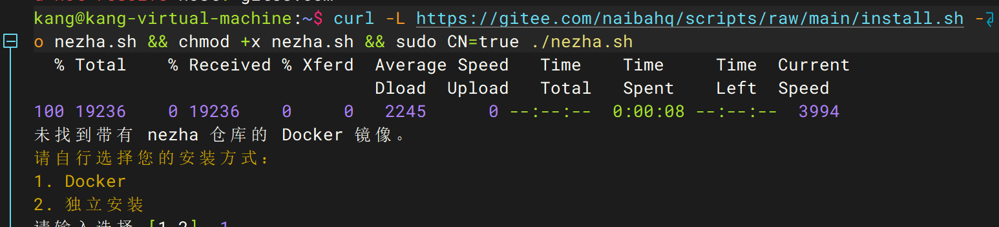
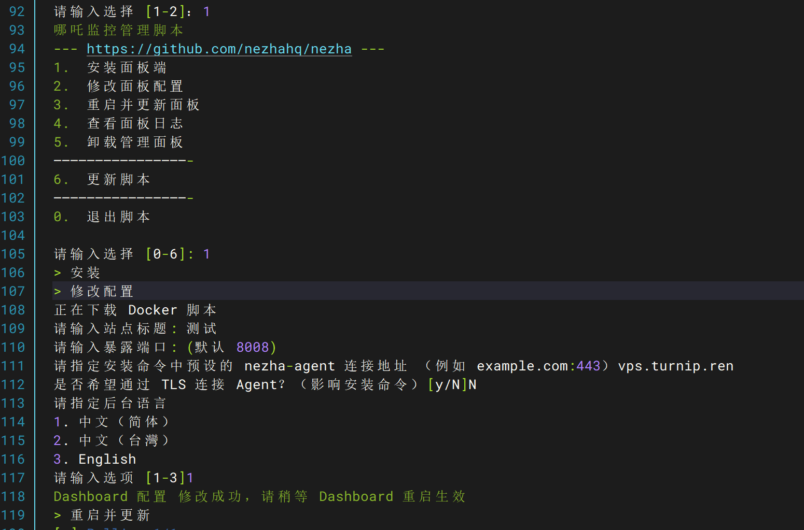
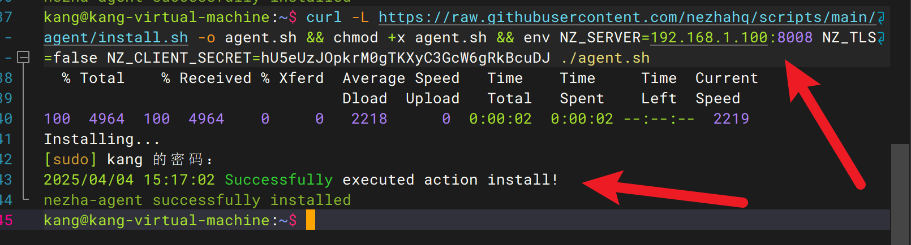

---

title: 哪吒监控 V1-快速配置（本地虚拟机为例）

published: 2025-04-04 15:54:14

description: 开源、轻量、易用的服务器监控与运维工具

tags: [Kubernetes, Docker]

category: backend

draft: false

---

# 哪吒监控 V1-快速配置（本地虚拟机为例）

开源、轻量、易用的服务器监控与运维工具

### 系统要求：

* linux

## 安装

国际

    curl -L https://raw.githubusercontent.com/nezhahq/scripts/refs/heads/main/install.sh -o nezha.sh && chmod +x nezha.sh && sudo ./nezha.sh

中国大陆

    curl -L https://gitee.com/naibahq/scripts/raw/main/install.sh -o nezha.sh && chmod +x nezha.sh && sudo CN=true ./nezha.sh

### 步骤

* 1.选择Docker安装
  
* 2.面板安装，注意：域名vps.turnip.ren，如果是本地虚拟机的，这里是没有用的
  
* 3.再次打开一个会话，安装Agent端。注意：Agent端就是被监控端，如果是本地虚拟机，需要填写ip+端口