# 大模型本地部署

1.前置条件

* docker ，需要有docker，使用docker可以运行LobeChat，windows可以下载Docker Desktop，我这里使用的就是Docker Desktop

* 网络尽量能够连接世界网
  
  
  
  

### 目标：

1.使用Ollama部署大模型；这里部署后的大模型是命令行的。

2.使用LobeChat连接本地的大模型；LobeChat是一个的开源 AI 聊天框架，可以一键集成很多大模型，主要是它提供了美观UI界面。


## 一、ollama相关的配置

### 1.下载和安装

下载地址： [在macOS上下载Ollama - Ollama 框架](https://ollama.org.cn/download)  ；安装是一键式的，一般不会有问题，如果安装失败了，自行解决。

大模型市场：

中文版： https://ollama.org.cn/  不好用，搜索功能不能用，只能在 **模型** 里找

世界版： https://ollama.com/ 顶部可以搜索大模型名

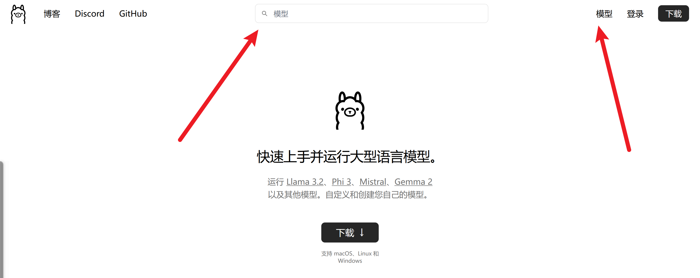

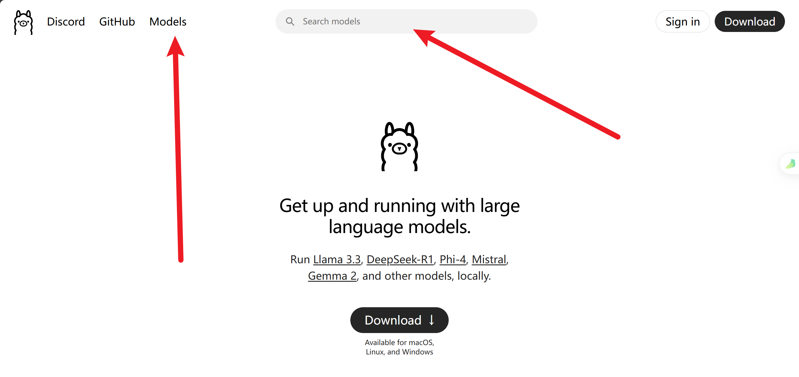


### 2.基本操作

搜索、找到想要本地部署的模型名

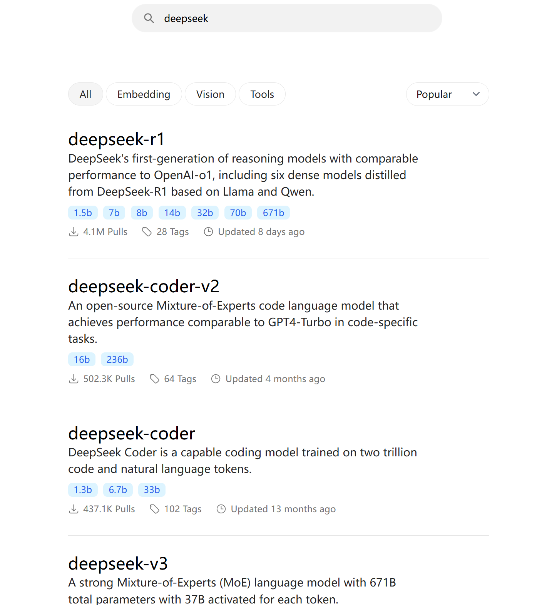


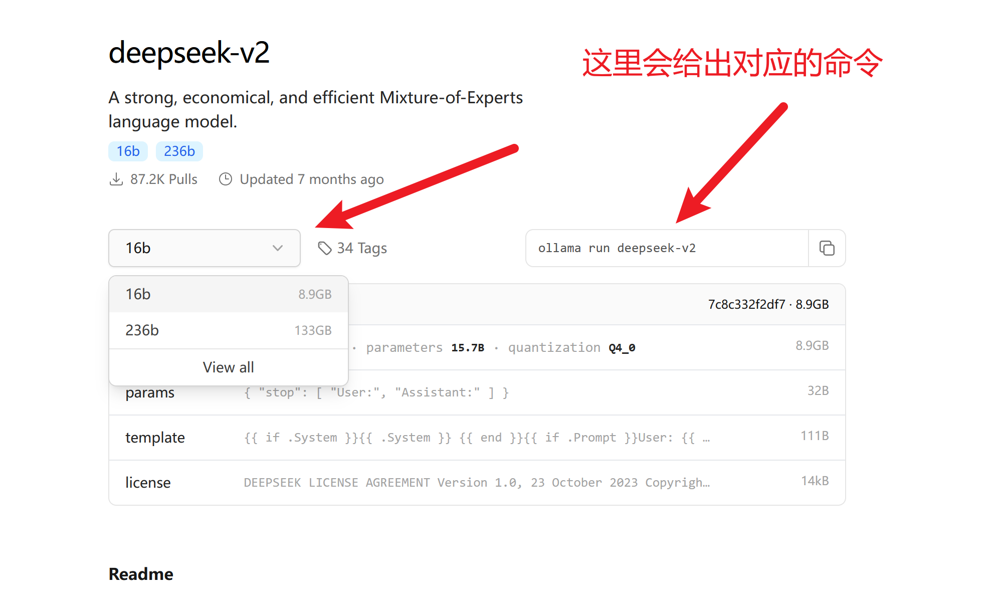

DeepSeek的模型都很大，我这里就使用r2版本的了，比较小，操作都是一样的。

直接复制命令运行就可以了。

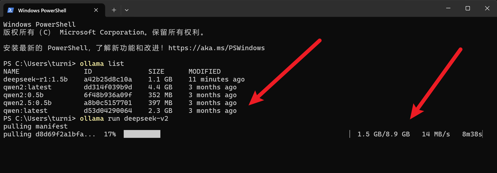

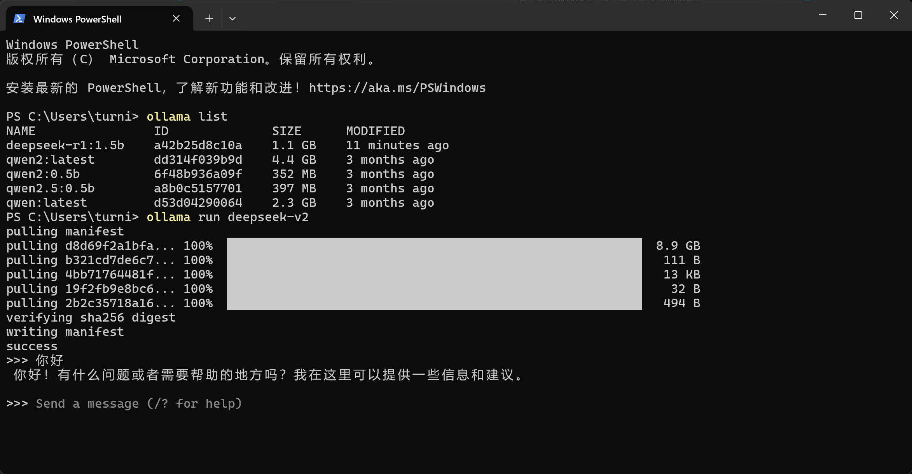

和docker类型，本地已经有，就会用本地的，本地没有就会自动拉取，然后运行。


## 二、LobeChat相关的配置

### 1.下载和安装

 官网： https://lobehub.com/zh       可以在线使用，自行探索

本地配置： https://lobehub.com/zh/docs/usage/features/local-llm  本地在docker中启动一个LobeChat，需要使用docker。

```bash
docker run -d -p 3210:3210 -e OLLAMA_PROXY_URL=http://host.docker.internal:11434/v1 lobehub/lobe-chat
```

直接使用docker运行即可

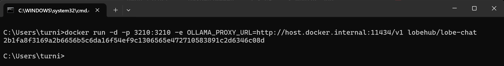


点击Port(s)的端口号就可以打开LobeChat的页面了。

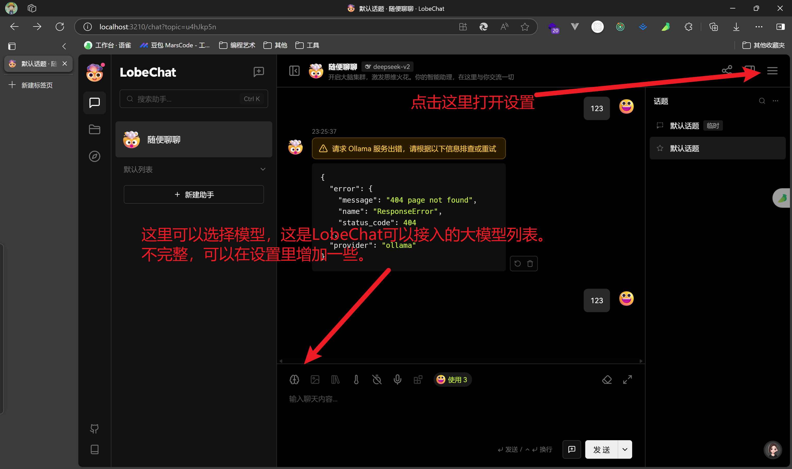

在设置里，进行对应模型的添加即可。有一些模型是没有的，没有就是LobeChat没有接入。

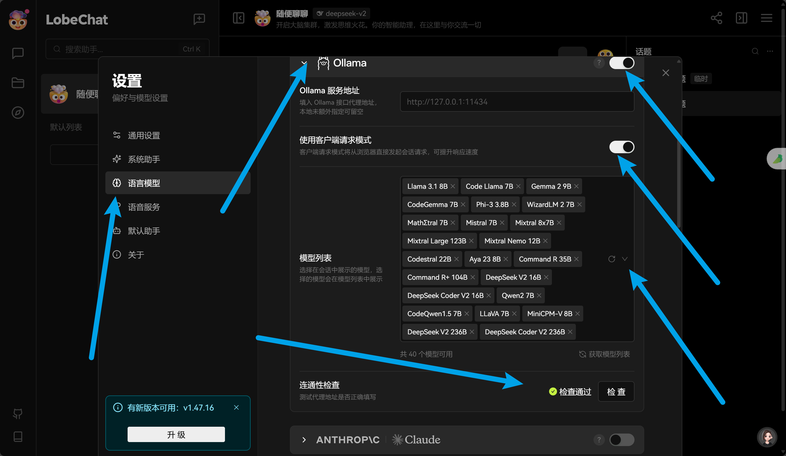

选择下载好的大模型即可，然后就可以聊天了。

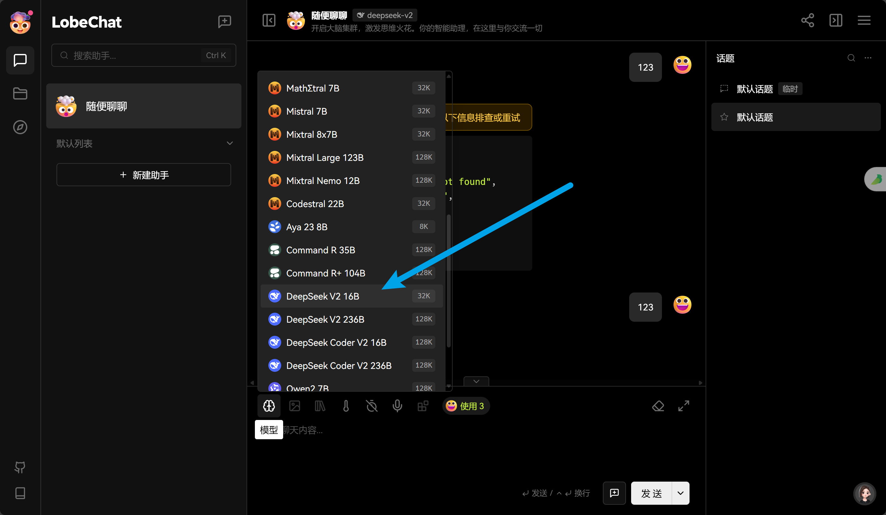

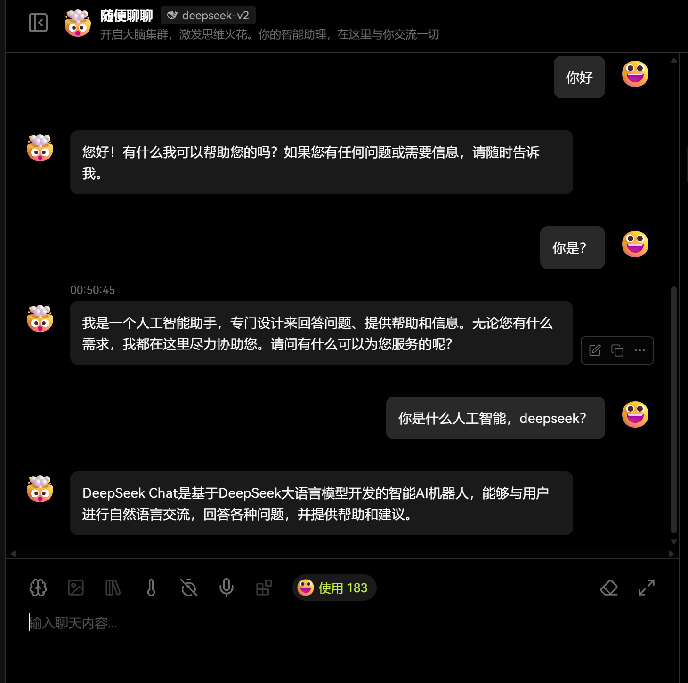
