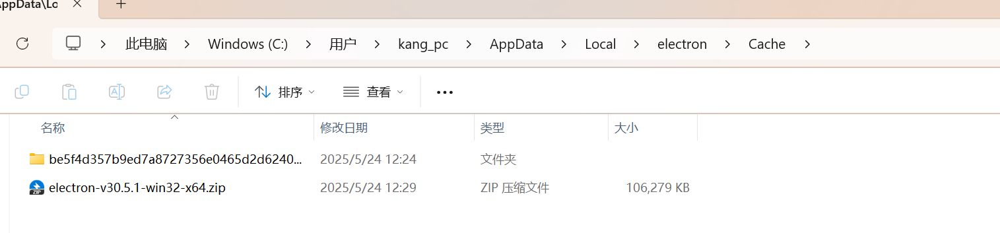
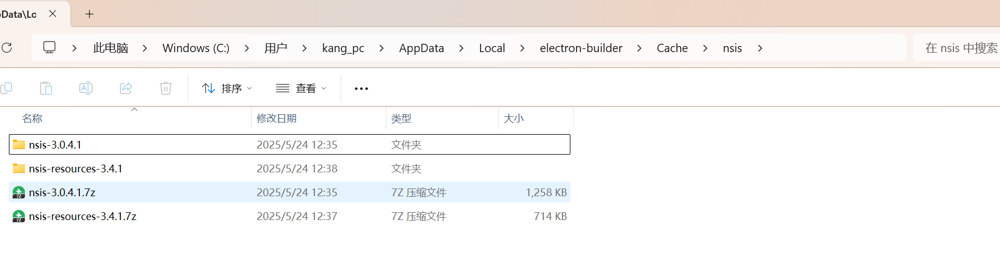
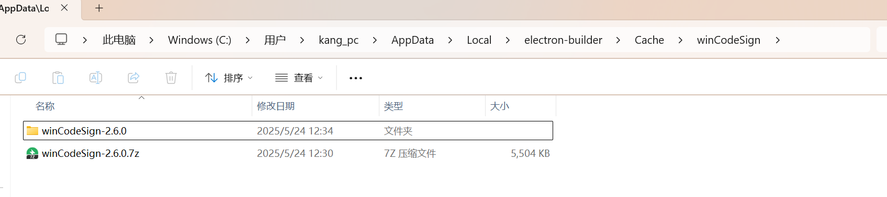
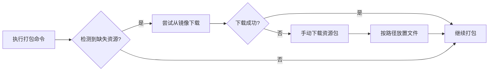

---

title: Windows 11 下使用 electron-builder 打包的资源下载与配置指南

published: 2025-05-24 13:20:43

description: Windows 11 下使用 electron-builder 打包的资源下载与配置指南

tags: [Electron, JavaScript]

category: frontend

draft: false

---

# Windows 11 下使用 electron-builder 打包的资源下载与配置指南

## 一、所需压缩包清单
以下是 electron-builder 打包过程中可能需要手动下载的资源包（以特定版本为例）：
- **electron-v30.5.1-win32-x64.zip**  
  *用途*：Electron 运行时核心文件  
- **nsis-3.0.4.1.7z**  
  *用途*：NSIS 安装包构建工具（Nullsoft Scriptable Install System）  
- **nsis-resources-3.4.1.7z**  
  *用途*：NSIS 资源文件（如语言包、图标等）  
- **winCodeSign-2.6.0.7z**  
  *用途*：Windows 代码签名工具  

**版本对应关系**：  
```json
"dependencies": {
  "electron": "^30.0.1",
  "electron-builder": "^24.13.3"
}
```


## 二、下载与安装路径指引
### 1. electron-v30.5.1-win32-x64.zip  
- **存放路径**：  
  ```bash
  C:\Users\你的用户名\AppData\Local\electron\Cache
  ```  
  - 若路径不存在，需手动创建 `electron/Cache` 目录  
  - *示例*：`C:\Users\kang_pc\AppData\Local\electron\Cache`  

### 2. nsis-3.0.4.1.7z  
- **操作步骤**：  
  ① 解压文件到指定目录  
  ```bash
  C:\Users\你的用户名\AppData\Local\electron-builder\Cache\nsis
  ```  
  ② 确保目录结构为 `nsis/nsis-3.0.4.1`（解压后自动生成）  

### 3. nsis-resources-3.4.1.7z  
- **操作步骤**：  
  ① 解压文件到指定目录  
  ```bash
  C:\Users\你的用户名\AppData\Local\electron-builder\Cache\nsis
  ```  
  ② 资源文件需与 NSIS 工具文件同级存放，无需额外创建目录  

### 4. winCodeSign-2.6.0.7z  
- **操作步骤**：  
  ① 解压文件到指定目录  
  ```bash
  C:\Users\你的用户名\AppData\Local\electron-builder\Cache\winCodeSign
  ```  
  ② 确保目录结构为 `winCodeSign/winCodeSign-2.6.0`  


总结：
* electron-v30.5.1-win32-x64.zip 放到 C:\Users\kang_pc\AppData\Local\electron\Cache

* nsis-3.0.4.1.7z 解压到 C:\Users\kang_pc\AppData\Local\electron-builder\Cache\nsis中

* nsis-resources-3.4.1.7z 解压到 C:\Users\kang_pc\AppData\Local\electron-builder\Cache\nsis中

* winCodeSign-2.6.0.7z 解压到 C:\Users\kang_pc\AppData\Local\electron-builder\Cache\winCodeSign中


## 三、镜像加速配置（推荐方案）
### 1. 创建 `.npmrc` 文件  
在项目根目录新建 `.npmrc` 文件（若无该文件），添加以下镜像配置：  
```ini
# npm 镜像
registry=https://registry.npmmirror.com/
# Electron 镜像（关键！）
electron_mirror=https://npmmirror.com/mirrors/electron/
# electron-builder 相关工具镜像（可选，部分场景需手动配置）
electron-builder_binaries_mirror=https://npmmirror.com/mirrors/electron-builder-binaries/
```

### 2. 生效方式  
配置完成后，执行 `npm install` 或 `yarn install` 时会自动从镜像拉取资源。  
**注意**：若仍提示下载失败，可能需手动下载资源包并放置到指定路径（见上文）。


## 四、常见问题与解决方案
### 1. 路径找不到错误  
- **原因**：用户目录包含中文或特殊符号（如 `kang_pc` 为英文用户名，无需担心）  
- **解决**：确保路径中的用户名是英文，或手动创建英文路径（如 `C:\electron-cache`）。  

### 2. 下载速度慢或失败  
- **方案一**：使用镜像加速（见上文 `.npmrc` 配置）  
- **方案二**：手动下载资源包（需科学上网）  
  - 下载地址：  
    - [Electron 镜像站](https://npmmirror.com/mirrors/electron/)  
    - [NSIS 官方下载](https://nsis.sourceforge.net/Download)  
    - [winCodeSign 仓库](https://github.com/electron-userland/win-code-sign/releases)  

### 3. 版本不兼容问题  
- **检查**：确保 electron 与 electron-builder 版本兼容（本文示例为 `electron@30.x` + `electron-builder@24.x`）  
- **更新**：通过 `npm outdated` 查看依赖版本，使用 `npm update` 升级至兼容版本。


## 五、总结流程图


通过以上步骤，可有效解决 Windows 11 下 electron-builder 打包时的资源下载问题，提升打包效率。建议优先使用镜像加速，减少手动操作成本。