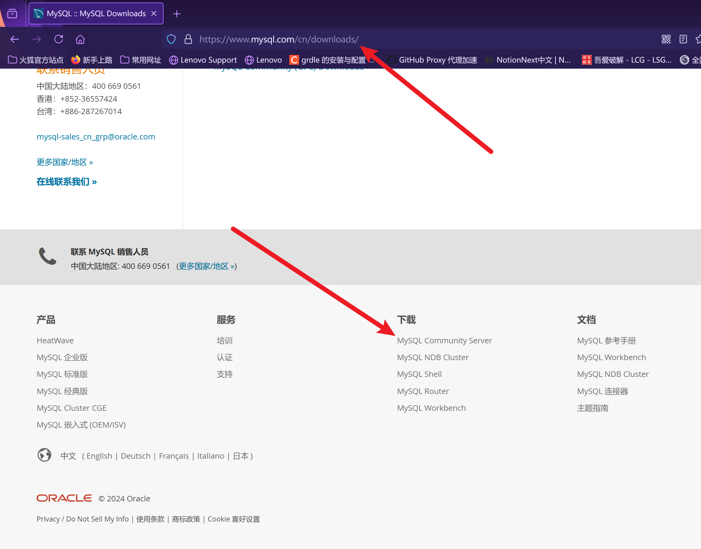
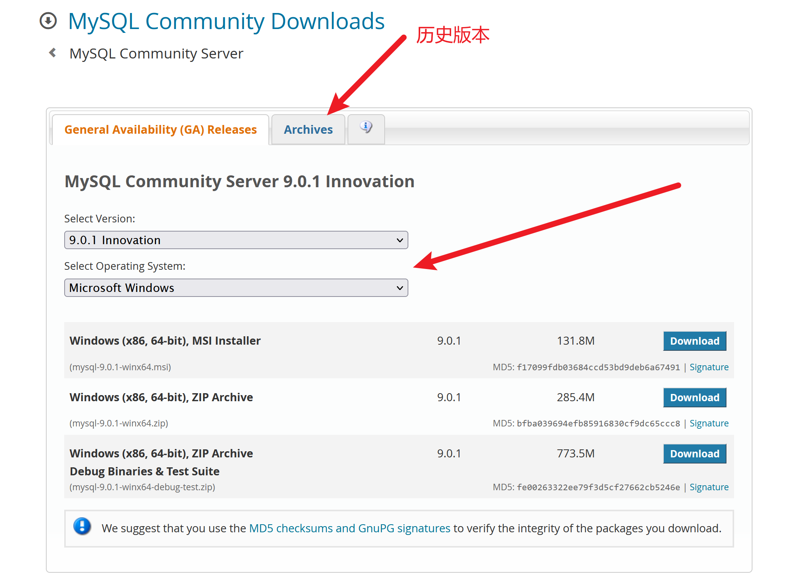
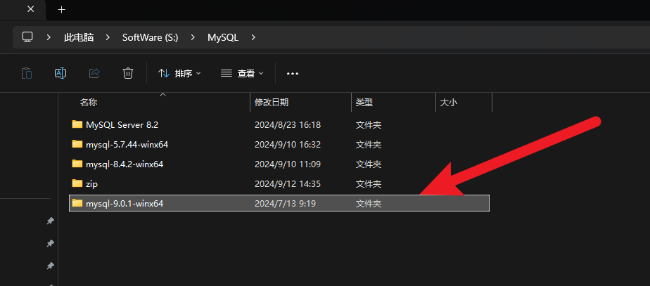
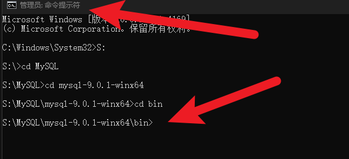
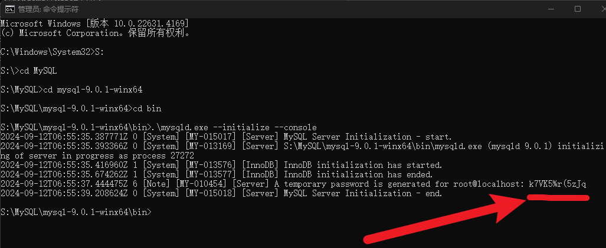
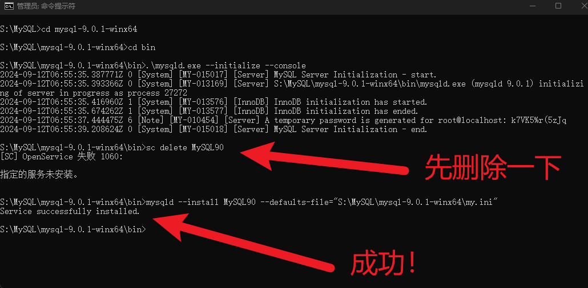
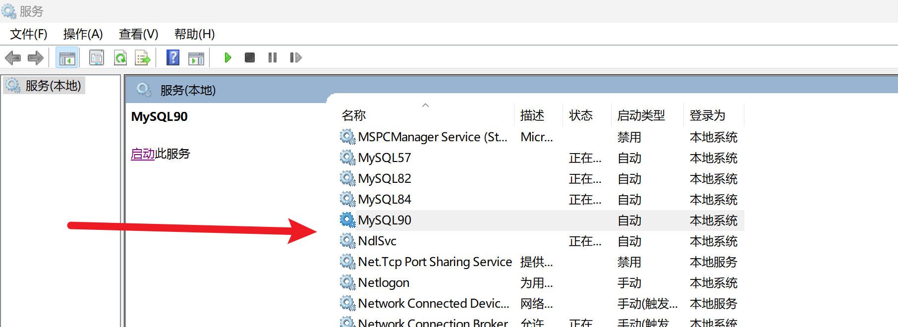
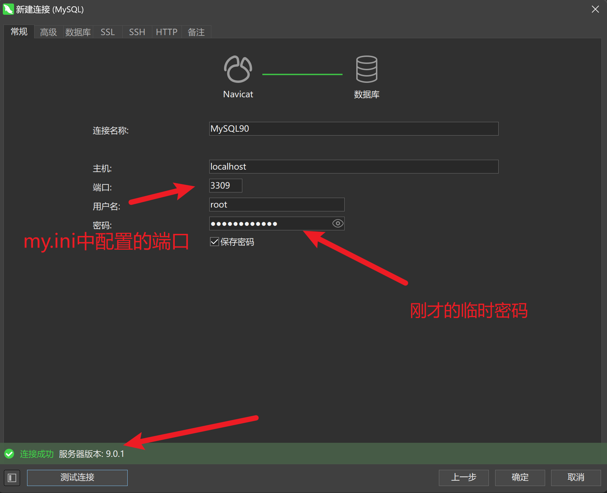

---

title: 从零配置MySQL绿色版

published: 2025-03-03 16:24:57

description: 手动配置绿色版的MySQL

tags: [MySQL]

category: database

draft: false

---

# 从零配置MySQL绿色版

## 一、打开MySQL的官网，下载想要版本的MySQL、解压即可。我这里以MySQL9为例。







## 二、创建my.ini文件，并写入配置。

注意：Windows系统下是.ini文件，Linux系统下是.cof文件

主要修改的配置是[client]下的port；[mysqld]下的port、basedir、datadir

*注意：这里只是部分的配置，更多的配置请查看文档，或者AI搜索*

    # For advice on how to change settings please see
    # http://dev.mysql.com/doc/refman/5.6/en/server-configuration-defaults.html
    # *** DO NOT EDIT THIS FILE. It's a template which will be copied to the
    # *** default location during install, and will be replaced if you
    # *** upgrade to a newer version of MySQL.
    [client]
    port=3309
    
    [mysql]
    
    #log-error=d:/mysql_log_err.txt
    [mysqld]
    port=3309
    basedir=S:\MySQL\mysql-9.0.1-winx64
    datadir=S:\MySQL\mysql-9.0.1-winx64\Data
    character-set-server=utf8mb4
    #连接空闲时间 30分
    wait_timeout=1800
    #最大连接数
    max_connections=500
    
    #开启事件 
    event_scheduler = 1
    #开启慢查询日志
    slow_query_log = ON
    #slow_query_log_file = ../slow_query.log
    long_query_time = 5
    #禁用域名解析
    #skip-name-resolve
    #禁用TCP/IP远程连接
    #skip-networking
    #key_buffer_size=16M
    #innodb_buffer_pool_size=4G
    #innodb_additional_mem_pool_size=20M
    #innodb_log_buffer_size=20M
    #query_cache_size=40M
    #read_buffer_size=4M
    #sort_buffer_size=4M
    #read_rnd_buffer_size=8M
    #tmp_table_size=16M
    #thread_cache_size=16
    # Remove leading # and set to the amount of RAM for the most important data
    # cache in MySQL. Start at 70% of total RAM for dedicated server, else 10%.
    # innodb_buffer_pool_size = 128M
    
    # Remove leading # to turn on a very important data integrity option: logging
    # changes to the binary log between backups.
    log_bin="k_logbin"
    
    # These are commonly set, remove the # and set as required.
    # basedir = .....
    # datadir = .....
    # port = .....
    # server_id = .....
    
    
    # Remove leading # to set options mainly useful for reporting servers.
    # The server defaults are faster for transactions and fast SELECTs.
    # Adjust sizes as needed, experiment to find the optimal values.
    # join_buffer_size = 128M
    # sort_buffer_size = 2M
    # read_rnd_buffer_size = 2M 
    
    sql-mode="STRICT_TRANS_TABLES,NO_ZERO_IN_DATE,NO_ZERO_DATE,ERROR_FOR_DIVISION_BY_ZERO,NO_ENGINE_SUBSTITUTION"
    log-bin-trust-function-creators=1
    

## 三、使用mysqld生成临时密码

1. 使用管理员模式进入MySQL的bin目录下
  
2. 使用mysqld执行--initialize --console命令 ，注意不同的命令行，调用mysqld的格式不一样，我这里是.\mysqld.exe --initialize --console**记住这个临时密码**
  

## 四、将MySQL服务注册到操作系统的服务管理中

**注意：这里需要使用管理员模式**

    sc delete MySQL90
    mysqld --install MySQL90 --defaults-file="S:\MySQL\mysql-9.0.1-winx64\my.ini"



* 打开服务界面启动服务即可



## 五、连接数据库，并修改密码

这里需要使用*步骤三* 获取的临时密码



* 点击确定后，双击连接名称，会提示让输入新密码