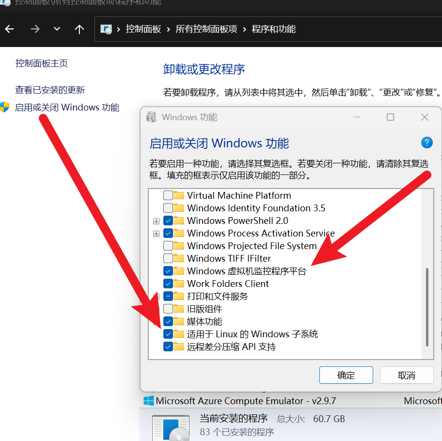
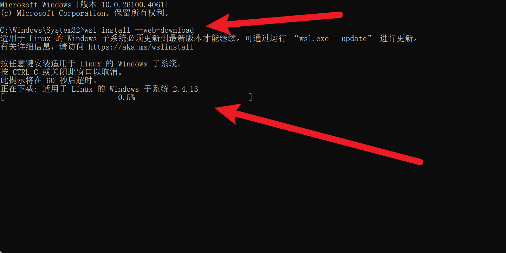
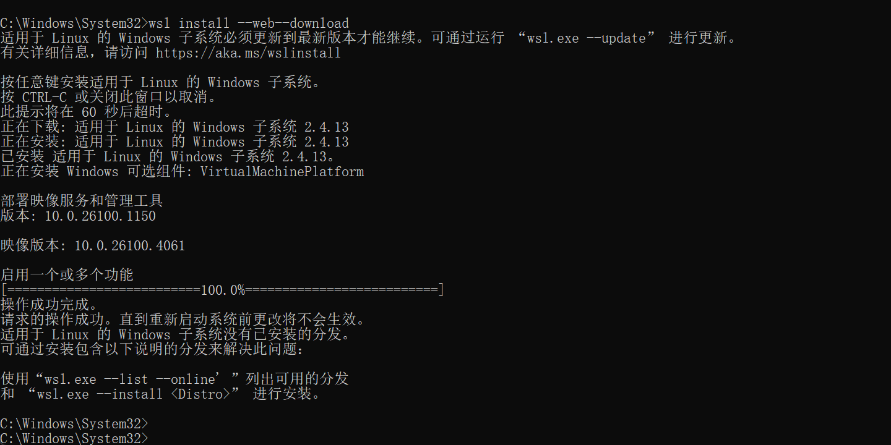
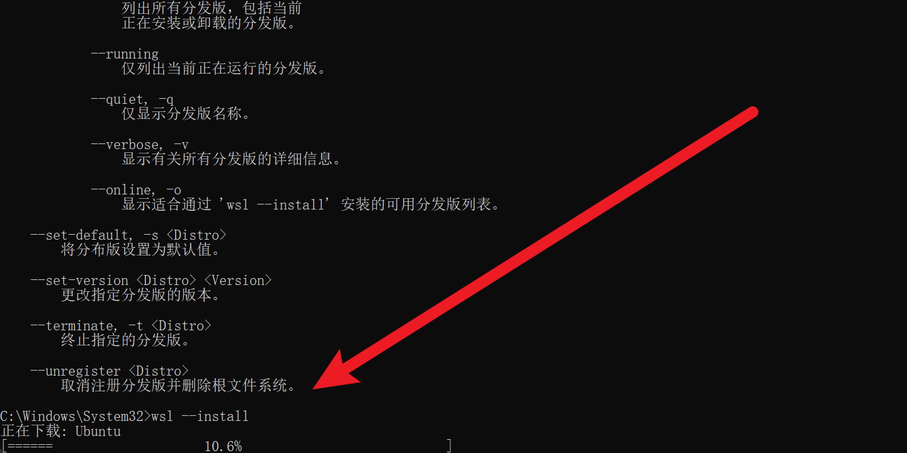
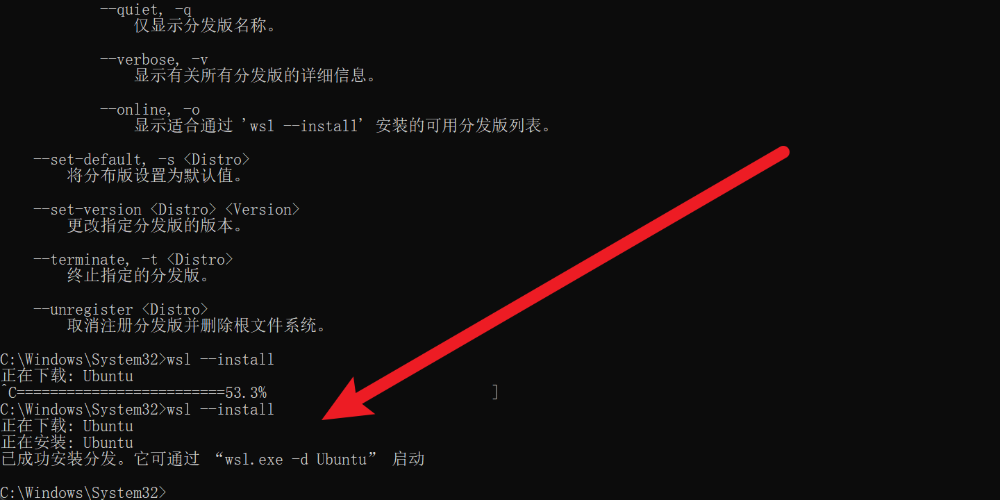
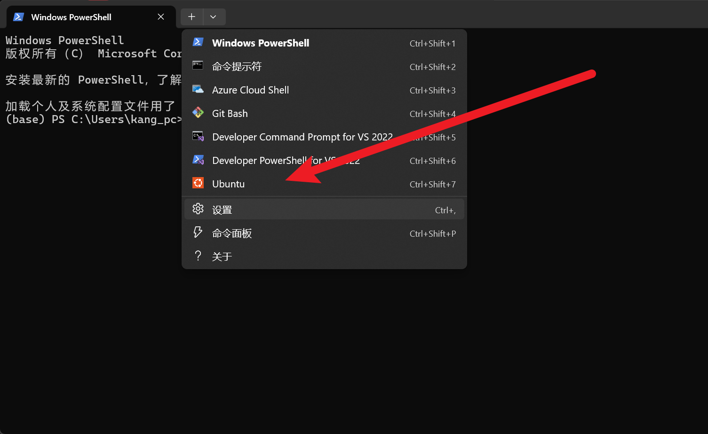
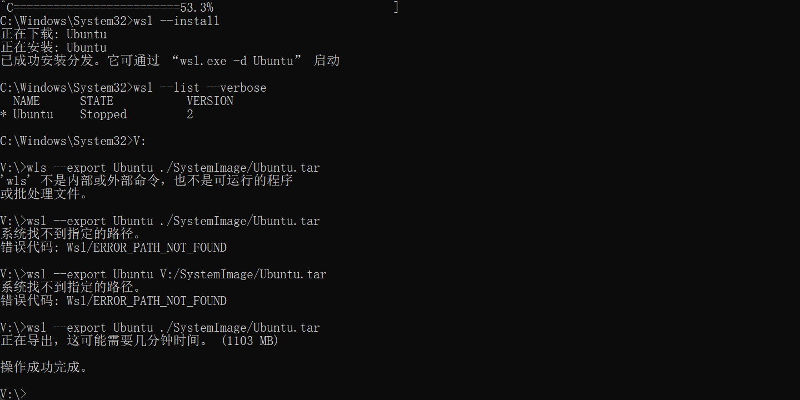
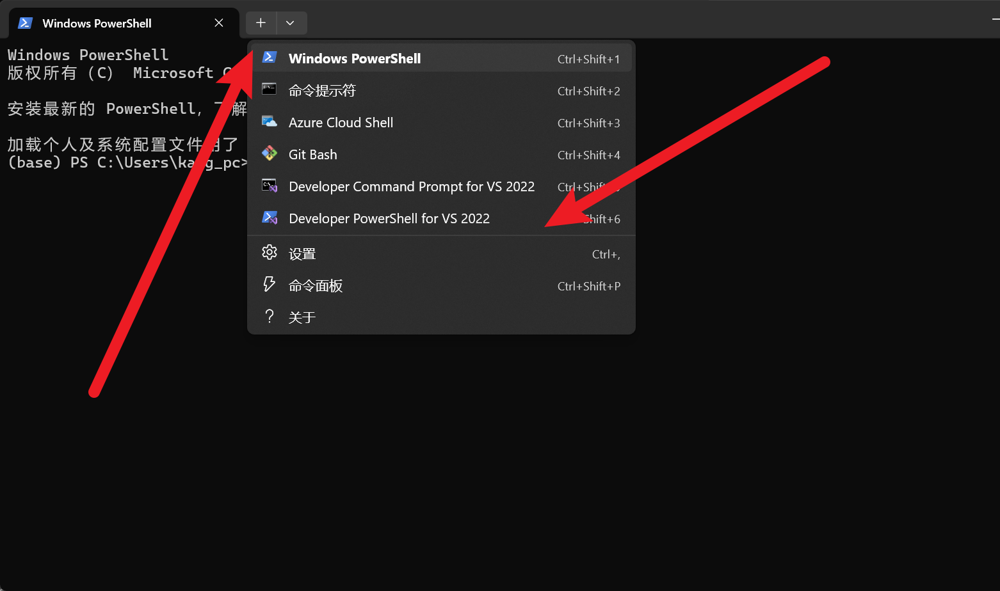
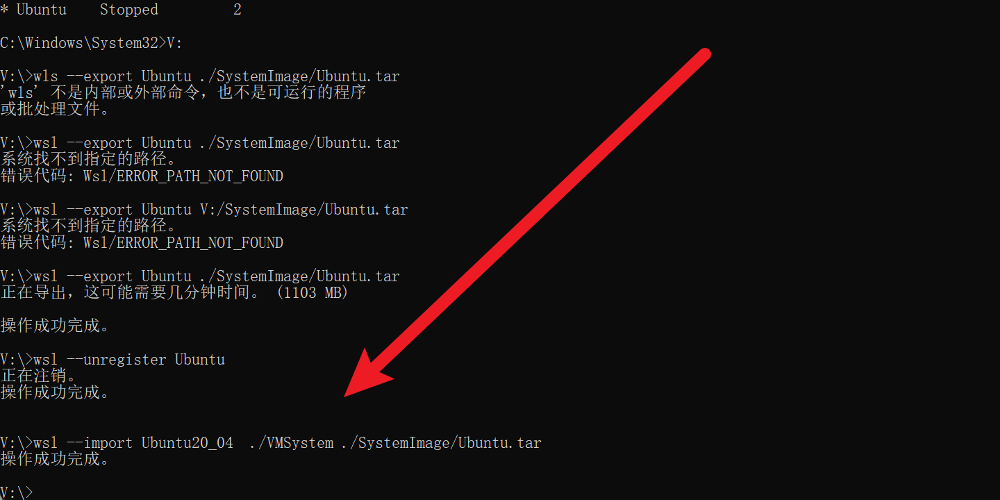

---

title: wsl安装教程

published: 2025-05-26 23:22:09

description: wsl安装教程

tags: [Blogging, Markdown]

category: backend

draft: false

---


# wsl安装教程

1.控制面板\所有控制面板项\程序和功能  开启 虚拟化平台和Linux子系统 这两个功能



2.管理员身份打开命令行界面, 输入命令（有时候没有--web-download这个选项，可能与wsl的版本有关，详情查看微软官网）

注意：这里是在执行更新wsl的操作，可能是我的wsl版本太低了，让我更新。更新之后就没有--web-download这个选项了

```bash
wsl install --web-download
```






这里更新之后需要重启电脑，否则无法安装Linux

重新之后，管理员模式命令行，执行命令：

```bash
wls --install
```

最好挂上梯子，不然下载的很慢





注意：这里默认安装到C盘，想换磁盘的话，需要先将子系统导出到其他盘，然后再导入子系统，后面有教学。

### 至此，wsl已经安装完成。

# 打开PowerShell 点击图标，即可启动！

-----------------

wsl基本操作:

```bash
# 列出在线版本
wsl --list --online 
#列出已安装的版本
wsl --list --verbose

# 设置 wsl 的版本；wsl有wsl1和wsl2；这个命令的意思是使用那个wsl平台来承载Linux
wsl --set-version <distribution name> <versionNumber>
# 设置默认版本
wsl --set-default-version <Version>
#删除子系统
wsl --unregister <DistributionName>

#更新wsl
wsl --update

#导出镜像
wsl --export <Distribution Name> <导出文件的路径>
#导入镜像
wsl --import <Distribution Name> <InstallLocation> <导入文件的路径>
```

## 下面来更改安装位置，更改安装位置需要通过导出、导入的操作

1.管理员模式打开命令行，切换到导出的位置 (切换位置主要为了确保别导出到System32这个目录下了)，执行命令：

```bash
# 要确保 文件夹 存在
wsl --export Ubuntu ./Systemimages/Ubuntu.tar  
```



2.删除此子系统

```bash
wsl --unregister Ubuntu
```

* 检查一下这个路径下还有没有Ubuntu的安装包(类似于这种名字CanonicalGroupLimited.UbuntuonWindows_79rhkp1fndgsc)，如果有也要删除。

C:\Users\你的用户名\AppData\Local\Packages

* 检查PowerShell还有没有Linux的选项，可以在 设置 里进行移除

3.导入刚才的压缩包



## 至此，切换安装位置完成
